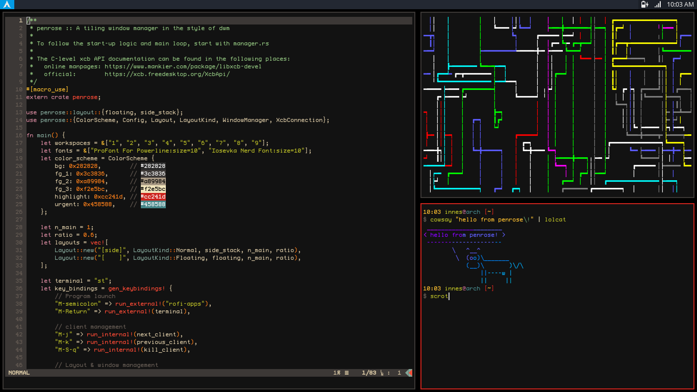

<image width="100px" src="icon.svg" align="left"></image>
penrose - a tiling window manager library
=========================================

 

`penrose` is a library for configuring your own X11 window manager in Rust. It
uses a workspace model as opposed to dwm style tags and is built on top of the
XCB API.  The project is very much a work in progress as I try to set up my
ideal, minimal window manager for daily use. That said, `penrose` is now feature
complete enough and stable enough to use as your primary Window Manager, so long
as you don't mind a few rough edges! I am aiming for the code to be well
documented and easy to extend. For now, this is my primary hobby project so
updates are frequent: I try to keep crates.io up to date but please check the
git repo for latest changes.

### Current project status
While the project is still in its early stages, please expect there to be
multiple breaking changes as the public API stabilises. The example config files
will always be kept up to date so please refer to them for updating to newer
versions published to cargo.

I am currently using penrose as [my daily driver](https://github.com/sminez/my-penrose-config)
and actively working on the project: poking around in the guts of various
existing window managers, seeing what I like and what I want to incorporate.
Development may be a little sporadic depending on what my current work / home
commitments are but you can typically expect to see updates every few days
currently. I am trying to provide some demos and examples on
[youtube](https://www.youtube.com/channel/UC04N-5DxEWH4ioK0bvZmF_Q) as I go,
particularly when major new features are added.

### Getting started
Depending on how much tinkering you want to do, there are several example
`main.rs` files in the `examples` directory that you can use as a starting point
for your configuration. You will need to ensure that you at least have a
terminal and program launcher set up (the defaults are `dmenu` and `st` from
https://suckless.org) otherwise you are going to be unable to spawn programs!

As mentioned above, my personal set up is also hosted on github and runs from
the head of develop as opposed to pinning at a specific released version. This
is not recommended in general as develop is not guaranteed to be stable in any
way (there are also likely to be intermittent breaking API changes as I iterate
on the best way to do things). The aim is to provide an Xmonad style "extend
with your own custom code" experience though obviously at present, penrose has
no where near the same number of out of the box libraries and examples to work
from so you will likely need to port over your favourite Xmonad / other WM
features if you find them missing. If you are happy to do so, please do raise a
PR and I can incorporate your favourite feature into some sort of `contrib`
directory so that others can use it as well.

If you update to a new version from crates.io (or are tracking develop) and you
suddenly get compile errors in your config, please check the documentaton hosted
on [docs.rs](https://docs.rs/penrose) to see if there have been any recent API
changes. I am trying to keep breaking changes to a minimum but at this early
stage in the project there are multiple things in flux as the codebase
stabilises.

### Current functionality
My personal set up has floated between a variety of tiling window managers over
the years, ranging from i3, dwm and Qtile to Xmonad, Wmii and BSPWM. `penrose`
is my attempt to cherry pick the functionality I make use of while also
providing a flexible base to build from should you want to get your hands dirty
with some rust yourself. As a non-exhaustive high-level overview of what is
currently implemented you can take a look at the list below. Alternatively, have
a look through the documentation (particularly the public methods on
`WindowManager`) to see what is available.

#### Implemented
- multi-monitor support
- dynamic layouts
- user defined hooks in response to `WindowManager` / `X` events
- partial EWMH support (active window/desktop, number of desktops, desktop names, window manager name, desktop for client)
- built in layout functions
- user definable layout functions
- hook based status bars
- scratchpads
- dynamic workspace creation
- custom key bindings (able to trigger arbitrary rust code)

### Project Non-goals
#### A config file
Parsing a config file and dynamically switching behaviour on the contents adds a
huge amount of complexity to the code. `penrose` is written as a library
("crate" in the rust lingo) that you use to build your window manager as you see
fit. There is a default set of behaviours that are mostly an opinionated hybrid of
[dwm](https://dwm.suckless.org/) and [i3](https://i3wm.org/) but you are free to
swap out pretty much everything should you wish.
For example, if you prefer `dwm` style tags to workspaces, you should be able to
get that up and running using the hooks system.

#### IPC / relying on external programs
I love acme from plan9 and how easy it is to drive it's state from external
programs (check out my [acme-corp](https://github.com/sminez/acme-corp) tools to
see what I mean) but that comes at the expense of the internal logic becoming
_massively_ more complicated. As few moving parts as possible is ideal. So,
things that are easy to acomplish using the XCB api (key bindings, simple
rendering of a bar etc) are in, full on IPC via an exposed API is out.
That's not to say that making use of external programs is out all together: just
that window manager functionaly is internally implemented rather than relying on
external processes for things like key bindings and window placement.
